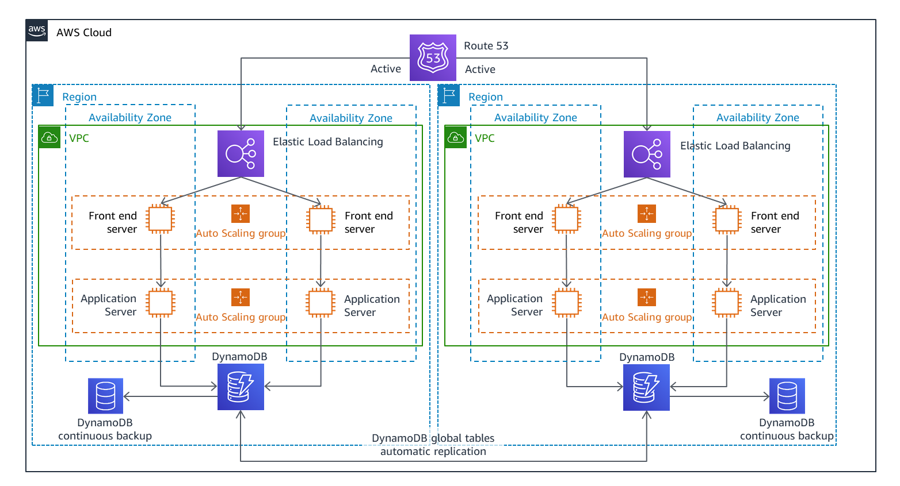

# Multi-region-highly available-architecture
This project demonstrates the deployment of a highly available, fault-tolerant architecture across multiple AWS regions using key AWS services, including EC2, Elastic Load Balancer (ELB), Auto Scaling, Route 53, and CloudWatch. The architecture is designed to handle varying traffic loads with seamless scaling and automatic failover, ensuring minimal downtime and high availability.

Using Terraform for Infrastructure as Code (IaC), this project provisions two VPCs across two AWS regions, each with EC2 instances behind an Application Load Balancer (ALB). The load balancers distribute traffic evenly between the regions, ensuring continuous service even if one region experiences issues. Auto Scaling adjusts the number of EC2 instances dynamically based on CPU utilization and traffic demand.

Route 53 is used for DNS failover, routing traffic to healthy regions, while CloudWatch monitors the EC2 instances and load balancers, triggering automatic scaling actions based on predefined metrics. This architecture ensures that the application remains resilient, cost-effective, and highly available.

